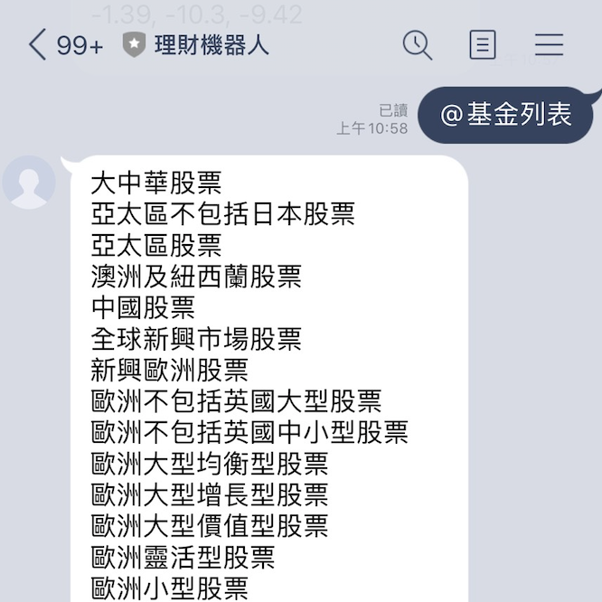
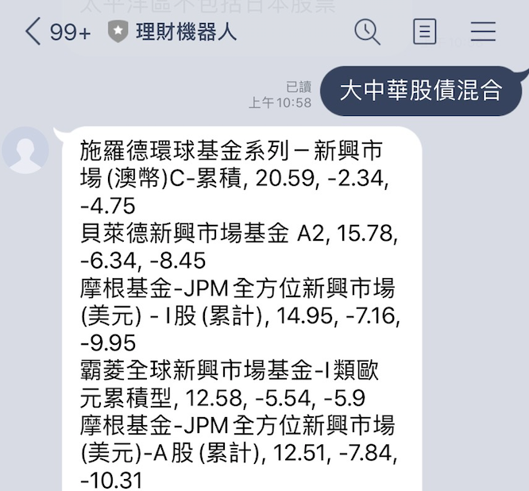

# 基金316法則Line聊天機器人

透過 Python 和Line Message API 製作的Line聊天機器人

# Feature

316 法則：

3 年績效在同類型基金的前 1/2

1 年績效在同類型基金的前 1/2

6 個月（半年）績效在同類型的前 1/2

最後取出同時符合以上條件的同類型基金（取交集），排除掉不符合的基金，即為篩選後的基金清單

# Quick view

### 輸入 ＠基金列表

### 輸入 大中華股債混合

# Packages

* requests
* pandas
* bs4 
* flask
* line-bot-sdk

